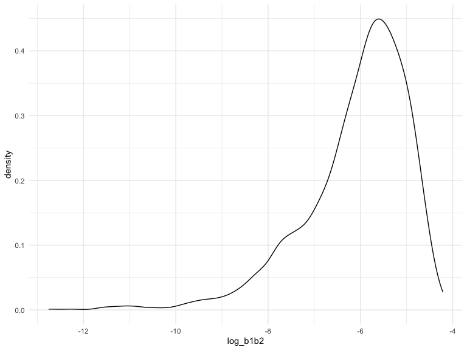

p8105_hw6_jw4348
================
Jingyu Wang
2023-12-01

## Problem 1

In the data cleaning code below we create a `city_state` variable,
change `victim_age` to numeric, modifiy victim_race to have categories
white and non-white, with white as the reference category, and create a
`resolution` variable indicating whether the homicide is solved. Lastly,
we filtered out the following cities: Tulsa, AL; Dallas, TX; Phoenix,
AZ; and Kansas City, MO; and we retained only the variables
`city_state`, `resolution`, `victim_age`, `victim_sex`, and
`victim_race`.

``` r
homicide_df = 
  read_csv("data/homicide-data.csv", na = c("", "NA", "Unknown")) |> 
  mutate(
    city_state = str_c(city, state, sep = ", "),
    victim_age = as.numeric(victim_age),
    resolution = case_when(
      disposition == "Closed without arrest" ~ 0,
      disposition == "Open/No arrest"        ~ 0,
      disposition == "Closed by arrest"      ~ 1)
  ) |> 
  filter(victim_race %in% c("White", "Black")) |> 
  filter(!(city_state %in% c("Tulsa, AL", "Dallas, TX", "Phoenix, AZ", "Kansas City, MO"))) |> 
  select(city_state, resolution, victim_age, victim_sex, victim_race)
```

    ## Rows: 52179 Columns: 12
    ## ── Column specification ────────────────────────────────────────────────────────
    ## Delimiter: ","
    ## chr (8): uid, victim_last, victim_first, victim_race, victim_sex, city, stat...
    ## dbl (4): reported_date, victim_age, lat, lon
    ## 
    ## ℹ Use `spec()` to retrieve the full column specification for this data.
    ## ℹ Specify the column types or set `show_col_types = FALSE` to quiet this message.

Next we fit a logistic regression model using only data from Baltimore,
MD. We model `resolved` as the outcome and `victim_age`, `victim_sex`,
and `victim_race` as predictors. We save the output as `baltimore_glm`
so that we can apply `broom::tidy` to this object and obtain the
estimate and confidence interval of the adjusted odds ratio for solving
homicides comparing non-white victims to white victims.

``` r
baltimore_glm = 
  filter(homicide_df, city_state == "Baltimore, MD") |> 
  glm(resolution ~ victim_age + victim_sex + victim_race, family = binomial(), data = _)

baltimore_glm |> 
  broom::tidy() |> 
  mutate(
    OR = exp(estimate), 
    OR_CI_upper = exp(estimate + 1.96 * std.error),
    OR_CI_lower = exp(estimate - 1.96 * std.error)) |> 
  filter(term == "victim_sexMale") |> 
  select(OR, OR_CI_lower, OR_CI_upper) |>
  knitr::kable(digits = 3)
```

|    OR | OR_CI_lower | OR_CI_upper |
|------:|------------:|------------:|
| 0.426 |       0.325 |       0.558 |

Below, by incorporating `nest()`, `map()`, and `unnest()` into the
preceding Baltimore-specific code, we fit a model for each of the
cities, and extract the adjusted odds ratio (and CI) for solving
homicides comparing non-white victims to white victims. We show the
first 5 rows of the resulting dataframe of model results.

``` r
model_results = 
  homicide_df |> 
  nest(data = -city_state) |> 
  mutate(
    models = map(data, \(df) glm(resolution ~ victim_age + victim_sex + victim_race, 
                             family = binomial(), data = df)),
    tidy_models = map(models, broom::tidy)) |> 
  select(-models, -data) |> 
  unnest(cols = tidy_models) |> 
  mutate(
    OR = exp(estimate), 
    OR_CI_upper = exp(estimate + 1.96 * std.error),
    OR_CI_lower = exp(estimate - 1.96 * std.error)) |> 
  filter(term == "victim_sexMale") |> 
  select(city_state, OR, OR_CI_lower, OR_CI_upper)

model_results |>
  slice(1:5) |> 
  knitr::kable(digits = 3)
```

| city_state      |    OR | OR_CI_lower | OR_CI_upper |
|:----------------|------:|------------:|------------:|
| Albuquerque, NM | 1.767 |       0.831 |       3.761 |
| Atlanta, GA     | 1.000 |       0.684 |       1.463 |
| Baltimore, MD   | 0.426 |       0.325 |       0.558 |
| Baton Rouge, LA | 0.381 |       0.209 |       0.695 |
| Birmingham, AL  | 0.870 |       0.574 |       1.318 |

Below we generate a plot of the estimated ORs and CIs for each city,
ordered by magnitude of the OR from smallest to largest. From this plot
we see that most cities have odds ratios that are smaller than 1,
suggesting that crimes with male victims have smaller odds of resolution
compared to crimes with female victims after adjusting for victim age
and race. This disparity is strongest in New yrok. In roughly half of
these cities, confidence intervals are narrow and do not contain 1,
suggesting a significant difference in resolution rates by sex after
adjustment for victim age and race.

``` r
model_results |> 
  mutate(city_state = fct_reorder(city_state, OR)) |> 
  ggplot(aes(x = city_state, y = OR)) + 
  geom_point() + 
  geom_errorbar(aes(ymin = OR_CI_lower, ymax = OR_CI_upper)) + 
  theme(axis.text.x = element_text(angle = 90, hjust = 1))
```


## Problem 2

### First, I will download the Central Park weather data.

``` r
weather_df = 
  rnoaa::meteo_pull_monitors(
    c("USW00094728"),
    var = c("PRCP", "TMIN", "TMAX"), 
    date_min = "2022-01-01",
    date_max = "2022-12-31") |>
  mutate(
    name = recode(id, USW00094728 = "CentralPark_NY"),
    tmin = tmin / 10,
    tmax = tmax / 10) |>
  select(name, id, everything())
```

    ## using cached file: /Users/jing/Library/Caches/org.R-project.R/R/rnoaa/noaa_ghcnd/USW00094728.dly

    ## date created (size, mb): 2023-12-01 16:21:36.528857 (8.544)

    ## file min/max dates: 1869-01-01 / 2023-11-30

### Then I will clean the dataset.

``` r
centralpark_df = 
  weather_df |> 
  drop_na(prcp, tmax, tmin) |> 
  select(id, tmax, tmin, prcp)

centralpark_df
```

    ## # A tibble: 365 × 4
    ##    id           tmax  tmin  prcp
    ##    <chr>       <dbl> <dbl> <dbl>
    ##  1 USW00094728  13.3  10     201
    ##  2 USW00094728  15     2.8    10
    ##  3 USW00094728   2.8  -5.5     0
    ##  4 USW00094728   1.1  -7.1     0
    ##  5 USW00094728   8.3  -0.5    58
    ##  6 USW00094728   5     1.1     0
    ##  7 USW00094728   1.1  -3.8    97
    ##  8 USW00094728  -1    -6.6     0
    ##  9 USW00094728   4.4  -1.6    25
    ## 10 USW00094728   4.4  -4.3     0
    ## # ℹ 355 more rows

### Then I will use 5000 bootstrap samples and produce estimates of `R square` quantities.

``` r
boot_sample = function(df) {
  
  sample_frac(df, replace = TRUE)
  
}

boot_results_rsquare = 
  tibble(strap_number = 1:5000) |> 
  mutate(
    strap_sample = map(strap_number, \(i) boot_sample(centralpark_df)),
    models = map(strap_sample, \(df) lm(tmax ~ tmin + prcp, data = df)),
    results = map(models, broom::glance)
  ) |> 
  select(strap_number, results) |> 
  unnest(results)
```

### Then I will Plot the distribution of `rsquare`.

``` r
boot_results_rsquare |> 
  ggplot(aes(x = r.squared)) +
  geom_density()
```


- The plot is a left-skewed of R-squared values from 5000 bootstrap
  samples, centered around 0.913, indicating a model fit that explains
  about 91.3% of the variance in the maximum temperature, based on
  minimum temperature and precipitation. The longer tail towards lower
  values indicates some samples with less explained variance, possibly
  due to variability or outliers in those samples.

### Then I will construct `95% confidence interval` of rsquare

``` r
boot_results_rsquare |> 
  summarize(
    ci_lower = quantile(r.squared, 0.025),
    ci_upper = quantile(r.squared, 0.975)
  )
```

    ## # A tibble: 1 × 2
    ##   ci_lower ci_upper
    ##      <dbl>    <dbl>
    ## 1    0.889    0.941

### Next I will use 5000 bootstrap samples and produce estimates of `log(beta1*beta2)` quantities.

``` r
boot_results_logbeta = 
  tibble(strap_number = 1:5000) |> 
  mutate(
    strap_sample = map(strap_number, \(i) boot_sample(centralpark_df)),
    models = map(strap_sample, \(df) lm(tmax ~ tmin + prcp, data = df)),
    results = map(models, broom::tidy)
  ) |> 
  select(strap_number, results) |> 
  unnest(results) |> 
  select(strap_number, term, estimate) |> 
  pivot_wider(
    names_from = term, 
    values_from = estimate) |> 
  rename(beta1 = tmin, beta2 = prcp) |>
  mutate(log_b1b2 = log(beta1 * beta2)) 
```

- Because there are a lot of negative values of variable `prec`
  resulting in **NaN** value of `log(beta1 * beta2)`.

### Then I will Plot the distribution of `log(beta1*beta2)`.

``` r
boot_results_logbeta |> 
  ggplot(aes(x = log_b1b2)) +
  geom_density()
```



- The plot is a left-skewed of R-squared values from 5000 bootstrap
  samples, centered around -5.5. This skew suggests outliers with small
  products of β1 and β2, influencing the shape of the distribution.

### Then I will construct `95% confidence interval` of log(beta1\*beta2).

``` r
boot_results_logbeta |> 
  filter(log_b1b2 != "NaN") |>
  summarize(
    ci_lower = quantile(log_b1b2, 0.025),
    ci_upper = quantile(log_b1b2, 0.975)
  )
```

    ## # A tibble: 1 × 2
    ##   ci_lower ci_upper
    ##      <dbl>    <dbl>
    ## 1    -9.22    -4.54

- Because we can’t compute the 95%CI for the estimates of `NaN` values,
  therefore we only produce the 95% confidence interval of
  `log(beta1*beta2)` only restricted **non-NaN** values.
