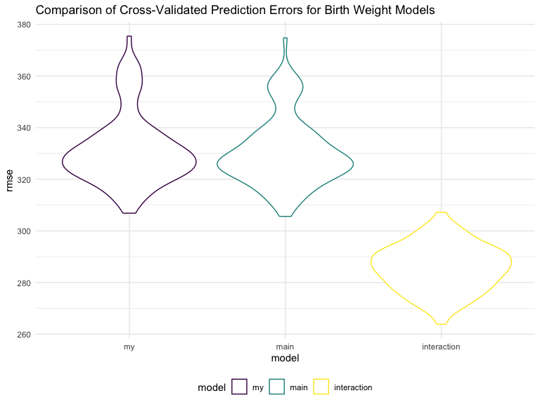

p8105_hw6_jw4348
================
Jingyu Wang
2023-12-01

## Problem 1

In the data cleaning code below we create a `city_state` variable,
change `victim_age` to numeric, modifiy victim_race to have categories
white and non-white, with white as the reference category, and create a
`resolution` variable indicating whether the homicide is solved. Lastly,
we filtered out the following cities: Tulsa, AL; Dallas, TX; Phoenix,
AZ; and Kansas City, MO; and we retained only the variables
`city_state`, `resolution`, `victim_age`, `victim_sex`, and
`victim_race`.

``` r
homicide_df = 
  read_csv("data/homicide-data.csv", na = c("", "NA", "Unknown")) |> 
  mutate(
    city_state = str_c(city, state, sep = ", "),
    victim_age = as.numeric(victim_age),
    resolution = case_when(
      disposition == "Closed without arrest" ~ 0,
      disposition == "Open/No arrest"        ~ 0,
      disposition == "Closed by arrest"      ~ 1)
  ) |> 
  filter(victim_race %in% c("White", "Black")) |> 
  filter(!(city_state %in% c("Tulsa, AL", "Dallas, TX", "Phoenix, AZ", "Kansas City, MO"))) |> 
  select(city_state, resolution, victim_age, victim_sex, victim_race)
```

    ## Rows: 52179 Columns: 12
    ## ── Column specification ────────────────────────────────────────────────────────
    ## Delimiter: ","
    ## chr (8): uid, victim_last, victim_first, victim_race, victim_sex, city, stat...
    ## dbl (4): reported_date, victim_age, lat, lon
    ## 
    ## ℹ Use `spec()` to retrieve the full column specification for this data.
    ## ℹ Specify the column types or set `show_col_types = FALSE` to quiet this message.

Next we fit a logistic regression model using only data from Baltimore,
MD. We model `resolved` as the outcome and `victim_age`, `victim_sex`,
and `victim_race` as predictors. We save the output as `baltimore_glm`
so that we can apply `broom::tidy` to this object and obtain the
estimate and confidence interval of the adjusted odds ratio for solving
homicides comparing non-white victims to white victims.

``` r
baltimore_glm = 
  filter(homicide_df, city_state == "Baltimore, MD") |> 
  glm(resolution ~ victim_age + victim_sex + victim_race, family = binomial(), data = _)

baltimore_glm |> 
  broom::tidy() |> 
  mutate(
    OR = exp(estimate), 
    OR_CI_upper = exp(estimate + 1.96 * std.error),
    OR_CI_lower = exp(estimate - 1.96 * std.error)) |> 
  filter(term == "victim_sexMale") |> 
  select(OR, OR_CI_lower, OR_CI_upper) |>
  knitr::kable(digits = 3)
```

|    OR | OR_CI_lower | OR_CI_upper |
|------:|------------:|------------:|
| 0.426 |       0.325 |       0.558 |

Below, by incorporating `nest()`, `map()`, and `unnest()` into the
preceding Baltimore-specific code, we fit a model for each of the
cities, and extract the adjusted odds ratio (and CI) for solving
homicides comparing non-white victims to white victims. We show the
first 5 rows of the resulting dataframe of model results.

``` r
model_results = 
  homicide_df |> 
  nest(data = -city_state) |> 
  mutate(
    models = map(data, \(df) glm(resolution ~ victim_age + victim_sex + victim_race, 
                             family = binomial(), data = df)),
    tidy_models = map(models, broom::tidy)) |> 
  select(-models, -data) |> 
  unnest(cols = tidy_models) |> 
  mutate(
    OR = exp(estimate), 
    OR_CI_upper = exp(estimate + 1.96 * std.error),
    OR_CI_lower = exp(estimate - 1.96 * std.error)) |> 
  filter(term == "victim_sexMale") |> 
  select(city_state, OR, OR_CI_lower, OR_CI_upper)

model_results |>
  slice(1:5) |> 
  knitr::kable(digits = 3)
```

| city_state      |    OR | OR_CI_lower | OR_CI_upper |
|:----------------|------:|------------:|------------:|
| Albuquerque, NM | 1.767 |       0.831 |       3.761 |
| Atlanta, GA     | 1.000 |       0.684 |       1.463 |
| Baltimore, MD   | 0.426 |       0.325 |       0.558 |
| Baton Rouge, LA | 0.381 |       0.209 |       0.695 |
| Birmingham, AL  | 0.870 |       0.574 |       1.318 |

Below we generate a plot of the estimated ORs and CIs for each city,
ordered by magnitude of the OR from smallest to largest. From this plot
we see that most cities have odds ratios that are smaller than 1,
suggesting that crimes with male victims have smaller odds of resolution
compared to crimes with female victims after adjusting for victim age
and race. This disparity is strongest in New yrok. In roughly half of
these cities, confidence intervals are narrow and do not contain 1,
suggesting a significant difference in resolution rates by sex after
adjustment for victim age and race.

``` r
model_results |> 
  mutate(city_state = fct_reorder(city_state, OR)) |> 
  ggplot(aes(x = city_state, y = OR)) + 
  geom_point() + 
  geom_errorbar(aes(ymin = OR_CI_lower, ymax = OR_CI_upper)) + 
  theme(axis.text.x = element_text(angle = 90, hjust = 1))
```


## Problem 2

### First, I will download the Central Park weather data.

``` r
weather_df = 
  rnoaa::meteo_pull_monitors(
    c("USW00094728"),
    var = c("PRCP", "TMIN", "TMAX"), 
    date_min = "2022-01-01",
    date_max = "2022-12-31") |>
  mutate(
    name = recode(id, USW00094728 = "CentralPark_NY"),
    tmin = tmin / 10,
    tmax = tmax / 10) |>
  select(name, id, everything())
```

    ## using cached file: /Users/jing/Library/Caches/org.R-project.R/R/rnoaa/noaa_ghcnd/USW00094728.dly

    ## date created (size, mb): 2023-12-01 16:21:36.528857 (8.544)

    ## file min/max dates: 1869-01-01 / 2023-11-30

### Then I will clean the dataset.

``` r
centralpark_df = 
  weather_df |> 
  drop_na(prcp, tmax, tmin) |> 
  select(id, tmax, tmin, prcp)

centralpark_df
```

    ## # A tibble: 365 × 4
    ##    id           tmax  tmin  prcp
    ##    <chr>       <dbl> <dbl> <dbl>
    ##  1 USW00094728  13.3  10     201
    ##  2 USW00094728  15     2.8    10
    ##  3 USW00094728   2.8  -5.5     0
    ##  4 USW00094728   1.1  -7.1     0
    ##  5 USW00094728   8.3  -0.5    58
    ##  6 USW00094728   5     1.1     0
    ##  7 USW00094728   1.1  -3.8    97
    ##  8 USW00094728  -1    -6.6     0
    ##  9 USW00094728   4.4  -1.6    25
    ## 10 USW00094728   4.4  -4.3     0
    ## # ℹ 355 more rows

### Then I will use 5000 bootstrap samples and produce estimates of `R square` quantities.

``` r
boot_results_rsquare =  
  centralpark_df |> 
  bootstrap(n = 5000) |> 
  mutate(
    models = map(strap, \(df) lm(tmax ~ tmin + prcp, data = df) ),
    results = map(models, broom::glance)) |> 
  select(-strap, -models) |> 
  unnest(results)
```

### Then I will Plot the distribution of `rsquare`.

``` r
boot_results_rsquare |> 
  ggplot(aes(x = r.squared)) +
  geom_density()
```


- The plot is a slightly left-skewed of R-squared values from 5000
  bootstrap samples, centered around 0.915, indicating a model fit that
  explains 91.5% of the variance in the maximum temperature, based on
  minimum temperature and precipitation. The longer tail towards lower
  values indicates some samples with less explained variance, possibly
  due to variability or outliers in those samples.

### Then I will construct `95% confidence interval` of rsquare

``` r
boot_results_rsquare |> 
  summarize(
    ci_lower = quantile(r.squared, 0.025),
    ci_upper = quantile(r.squared, 0.975)
  )
```

    ## # A tibble: 1 × 2
    ##   ci_lower ci_upper
    ##      <dbl>    <dbl>
    ## 1    0.889    0.941

- A 95% confidence interval for the `rsquared` is between **0.889** and
  **0.941**. This interval gives you a range of plausible values for the
  proportion of variance in the response variable (tmax) explained by
  the predictors (tmin and prcp). A high R-squared value close to 1
  indicates that a large proportion of the variability in the response
  variable is accounted for by the predictors, suggesting a good fit of
  the model to the data.

### Next I will use 5000 bootstrap samples and produce estimates of `log(beta1*beta2)` quantities.

``` r
boot_results_logbeta = 
  centralpark_df |> 
  bootstrap(n = 5000) |> 
  mutate(
    models = map(strap, \(df) lm(tmax ~ tmin + prcp, data = df) ),
    results = map(models, broom::tidy)) |> 
  select(-strap, -models) |> 
  unnest(results) |> 
  select(.id, term, estimate) |> 
  pivot_wider(
    names_from = term, 
    values_from = estimate) |> 
  rename(beta1 = tmin, beta2 = prcp) |>
  mutate(log_b1b2 = log(beta1 * beta2))
```

- Because there are a lot of negative values of variable `prec`
  resulting in **NaN** value of `log(beta1 * beta2)`.

### Then I will Plot the distribution of `log(beta1*beta2)`.

``` r
boot_results_logbeta |> 
  ggplot(aes(x = log_b1b2)) +
  geom_density()
```


- The plot is a left-skewed of R-squared values from 5000 bootstrap
  samples, centered around -5.5. This skew suggests outliers with small
  products of β1 and β2, influencing the shape of the distribution.

### Then I will construct `95% confidence interval` of log(beta1\*beta2).

``` r
boot_results_logbeta |> 
  filter(log_b1b2 != "NaN") |>
  summarize(
    ci_lower = quantile(log_b1b2, 0.025),
    ci_upper = quantile(log_b1b2, 0.975)
  )
```

    ## # A tibble: 1 × 2
    ##   ci_lower ci_upper
    ##      <dbl>    <dbl>
    ## 1    -8.88    -4.60

- Because we can’t compute the 95%CI for the estimates of `NaN` values,
  therefore we only produce the 95% confidence interval of
  `log(beta1*beta2)` only restricted **non-NaN** values.
- A 95% confidence interval for `log(beta1*beta2)` is between **-8.88**
  and **-4.60**. This interval is a range of plausible values for the
  logarithm of the product of the estimated coefficients for the
  predictors tmin and prcp in the linear regression model. The interval
  does not contain zero, it suggests that the product of the
  coefficients is significantly different from 1, indicating a potential
  interaction effect between `tmin` and `prcp`.

## Problem 3

### First I will load and clean the data for regression analysis, convert some variables from numeric to factor.

``` r
birthweight_df = 
  read_csv("data/birthweight.csv", na = c("", "NA", "Unknown")) |> 
  mutate(
    babysex = as.factor(babysex),
    frace = as.factor(frace),
    malform = as.factor(malform),
    mrace = as.factor(mrace)
  ) 
```

    ## Rows: 4342 Columns: 20
    ## ── Column specification ────────────────────────────────────────────────────────
    ## Delimiter: ","
    ## dbl (20): babysex, bhead, blength, bwt, delwt, fincome, frace, gaweeks, malf...
    ## 
    ## ℹ Use `spec()` to retrieve the full column specification for this data.
    ## ℹ Specify the column types or set `show_col_types = FALSE` to quiet this message.

``` r
birthweight_df
```

    ## # A tibble: 4,342 × 20
    ##    babysex bhead blength   bwt delwt fincome frace gaweeks malform menarche
    ##    <fct>   <dbl>   <dbl> <dbl> <dbl>   <dbl> <fct>   <dbl> <fct>      <dbl>
    ##  1 2          34      51  3629   177      35 1        39.9 0             13
    ##  2 1          34      48  3062   156      65 2        25.9 0             14
    ##  3 2          36      50  3345   148      85 1        39.9 0             12
    ##  4 1          34      52  3062   157      55 1        40   0             14
    ##  5 2          34      52  3374   156       5 1        41.6 0             13
    ##  6 1          33      52  3374   129      55 1        40.7 0             12
    ##  7 2          33      46  2523   126      96 2        40.3 0             14
    ##  8 2          33      49  2778   140       5 1        37.4 0             12
    ##  9 1          36      52  3515   146      85 1        40.3 0             11
    ## 10 1          33      50  3459   169      75 2        40.7 0             12
    ## # ℹ 4,332 more rows
    ## # ℹ 10 more variables: mheight <dbl>, momage <dbl>, mrace <fct>, parity <dbl>,
    ## #   pnumlbw <dbl>, pnumsga <dbl>, ppbmi <dbl>, ppwt <dbl>, smoken <dbl>,
    ## #   wtgain <dbl>

### Then I will check is there missing data in `birthweight_df`.

``` r
colSums(is.na(birthweight_df))
```

    ##  babysex    bhead  blength      bwt    delwt  fincome    frace  gaweeks 
    ##        0        0        0        0        0        0        0        0 
    ##  malform menarche  mheight   momage    mrace   parity  pnumlbw  pnumsga 
    ##        0        0        0        0        0        0        0        0 
    ##    ppbmi     ppwt   smoken   wtgain 
    ##        0        0        0        0

- There is no any missing values in **birthweight_df**.

### Then I will choose the variables I think might be factors of birthweight then fit in the model.

- In my model, I will include `blength`, `malform`, `ppbmi`, `wtgain`,
  `smoken`, and `momage` with the reasons based on a hypothesized
  structure for the factors that underly birthweight:

  - Mother’s Pre-pregnancy BMI (ppbmi): Maternal BMI is a crucial
    indicator of maternal health and nutrition status, which
    significantly affect fetal growth. Both underweight and overweight
    pre-pregnancy BMIs are associated with adverse birth outcomes.

  - Baby’s length at birth (blength): Birth length and birth weight are
    directly related, as both are indicators of the baby’s overall size
    and development. A longer baby is generally expected to weigh more.

  - Mother’s Age at Delivery (momage): Maternal age can influence birth
    outcomes, with very young and older mothers often facing higher
    risks of complications that can affect the baby’s birth weight.

  - Presence of Malformations (malform): Any congenital malformations
    could potentially impact the baby’s growth and development, thereby
    affecting birth weight.

  - Number of Cigarettes Smoked Per Day During Pregnancy (smoken):
    Smoking during pregnancy is a known risk factor for reduced fetal
    growth and low birth weight. The number of cigarettes smoked can
    have a dose-response relationship with birth weight.

  - Mother’s Weight Gain During Pregnancy (wtgain): Weight gain during
    pregnancy is directly related to fetal growth. Adequate weight gain
    is essential for a healthy birth weight, while both insufficient and
    excessive gains are risk factors for low and high birth weight,
    respectively.

``` r
birthweight_model =
  lm(bwt ~ ppbmi + blength + momage + malform + smoken + wtgain, 
     data = birthweight_df)

summary(birthweight_model)
```

    ## 
    ## Call:
    ## lm(formula = bwt ~ ppbmi + blength + momage + malform + smoken + 
    ##     wtgain, data = birthweight_df)
    ## 
    ## Residuals:
    ##     Min      1Q  Median      3Q     Max 
    ## -1676.4  -220.3    -7.2   205.6  4302.6 
    ## 
    ## Coefficients:
    ##               Estimate Std. Error t value Pr(>|t|)    
    ## (Intercept) -4017.8303    98.5154 -40.784  < 2e-16 ***
    ## ppbmi           7.8253     1.6128   4.852 1.27e-06 ***
    ## blength       132.7512     1.9191  69.172  < 2e-16 ***
    ## momage         11.8044     1.3258   8.904  < 2e-16 ***
    ## malform1       30.8692    86.4451   0.357    0.721    
    ## smoken         -2.7605     0.6889  -4.007 6.25e-05 ***
    ## wtgain          5.9192     0.4786  12.368  < 2e-16 ***
    ## ---
    ## Signif. codes:  0 '***' 0.001 '**' 0.01 '*' 0.05 '.' 0.1 ' ' 1
    ## 
    ## Residual standard error: 333.8 on 4335 degrees of freedom
    ## Multiple R-squared:  0.5758, Adjusted R-squared:  0.5752 
    ## F-statistic: 980.8 on 6 and 4335 DF,  p-value: < 2.2e-16

- Based on summary, most estimates are significant except the `malform`.
  The prediction seems pretty good.
- Variables `ppbmi`, `blength`, `momage`, `malform`, and `wtgain` have
  positive association with **baby’s weight**. `smoken` has negative
  association with **baby’s weight**.

### Then I will make a plot of model residuals against fitted values.

``` r
birthweight_df |> 
  add_predictions(birthweight_model) |> 
  add_residuals(birthweight_model) |> 
  ggplot(
    aes( x = pred, y = resid)) + 
    geom_point(alpha = 0.5) +
  labs(
    title = "Model residuals against fitted values",
    x = "Fitted Values",
    y = "Residuals"
      )
```


- The bulk of the data points form a dense cloud around the zero line of
  residuals, indicating that for many observations, the model’s
  predictions are close to the actual values. However, there’s a visible
  spread of residuals as the fitted values increase, which might
  indicate heteroscedasticity—meaning the variability of the residuals
  is not constant across all levels of the independent variable(s).
- Also, there are some outliers, particularly for lower and higher
  fitted values, should be investigated further as they can have a
  significant influence on the regression model.

### Then I will compare my model to two others:

``` r
cv_df =
  crossv_mc(birthweight_df, 100) |> 
  mutate(
    train = map(train, as_tibble),
    test = map(test, as_tibble)) |> 
  mutate(
    my_model = map(.x = train, ~lm(bwt ~ ppbmi + blength + momage + malform + smoken + wtgain, data = birthweight_df)),
    main_model = map(.x = train, ~lm(bwt ~ blength + gaweeks, data = birthweight_df)),
    interaction_model = map(.x = train, ~lm(bwt ~ bhead + blength + babysex + bhead * blength + blength * babysex + bhead * babysex + bhead * blength * babysex, data = birthweight_df))
         ) |> 
   mutate(
    rmse_my = map2_dbl(my_model, test, ~rmse(model = .x, data = .y)),
    rmse_main = map2_dbl(main_model, test, ~rmse(model = .x, data = .y)),
    rmse_interaction = map2_dbl(interaction_model, test, ~rmse(model = .x, data = .y))
         )
```

- **my_model** is the model based on a hypothesized structure for the
  factors that underly birthweight I made previously.
- **main_model** is the model using length at birth and gestational age
  as predictors (main effects only).
- **interaction_model** is the model using head circumference, length,
  sex, and all interactions (including the three-way interaction)
  between these.

### Finally, I’ll plot the prediction error distribution for each candidate model.

``` r
cv_df |> 
  select(starts_with("rmse")) |> 
  pivot_longer(
    everything(),
    names_to = "model", 
    values_to = "rmse",
    names_prefix = "rmse_") |> 
  mutate(model = fct_inorder(model)) |> 
  ggplot(aes(x = model, y = rmse, color = model)) + 
    geom_violin() +
    labs(
      title = "Comparison of Cross-Validated Prediction Errors for Birth Weight Models"
        )
```



- From the violin plot, `my_model` has similar rmse performance of
  `main_model`. And `interaction_model` has the best performance because
  of lowest overall rmse value.
- Possible reason of bad performance of `my_model` can be extremely
  outlier in some variables influence rmse, cause we can clearly see
  some outliers in the graph of **Model residuals against fittted
  values** previously.
